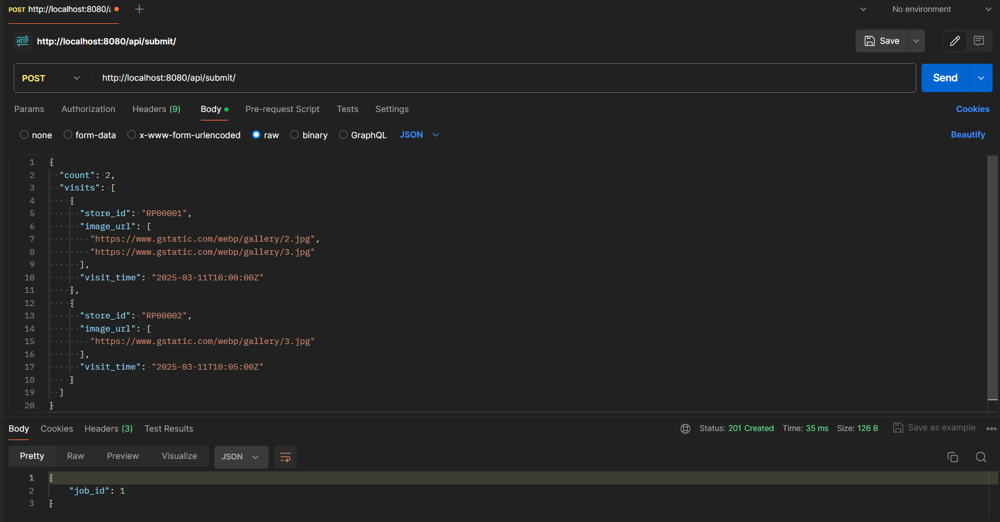
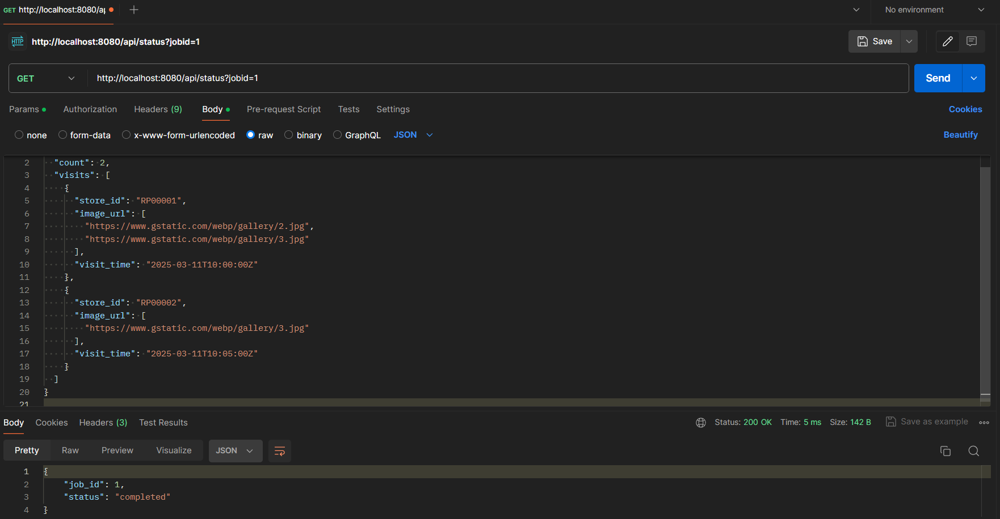
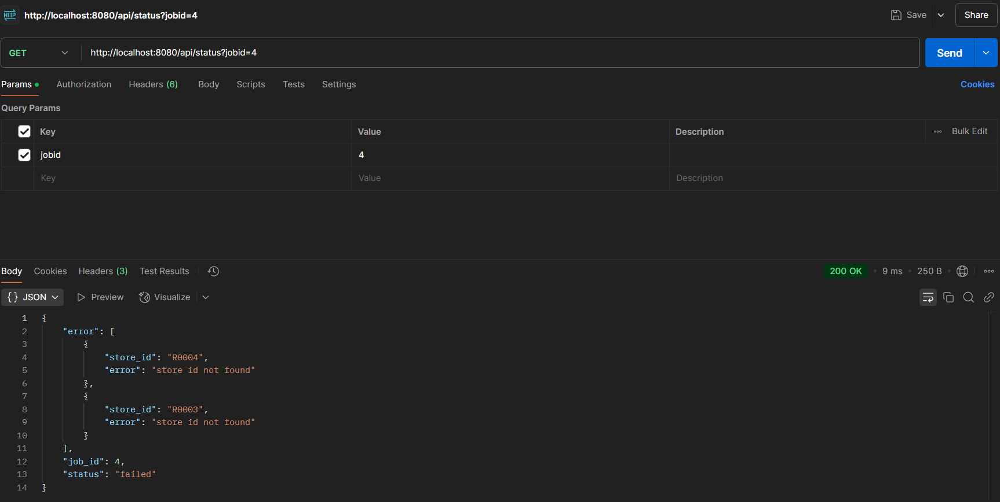
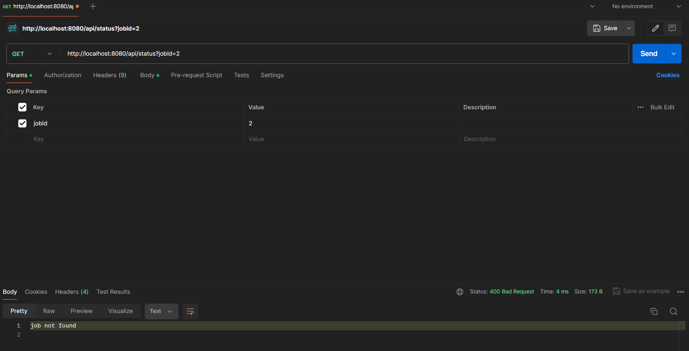

# Kirana-Club Backend Assignment

## Description
This service processes jobs that contain image URLs collected from various stores. For each image, the service:
- Downloads the image.
- Calculates the perimeter using the formula: **2 * (width + height)**.
- Simulates GPU processing with a random delay between 0.1 and 0.4 seconds.
- Stores the results at an image level.

Jobs are processed asynchronously. The service provides two endpoints:
- **Submit Job** (`/api/submit/`): To start processing a job.
- **Get Job Info** (`/api/status?jobid=...`): To check the status of the job.

If any image fails to download or decode, or if a `store_id` is not found in the store master CSV, the job is marked as "failed" and returns the appropriate error details.

## Assumptions
- The store master data is provided in a CSV file named `StoreMasterAssignment.csv`, which is loaded at startup.
- If any error occurs (e.g., store not found or image processing error), the entire job is marked as failed.
- All jobs and results are stored in memory; persistence is not implemented.
- The CSV file structure is as provided, with the first row as headers.

## Installation and Setup

### Prerequisites
- [Go 1.18+](https://golang.org/doc/install)
- [Docker](https://www.docker.com/) (optional)

### Running without Docker
1. Clone the repository.
2. Ensure `StoreMasterAssignment.csv` is in the project root.
3. Run `go mod download` to install dependencies (optional).
4. Start the service with:
   ```bash
   go run .
   ```
5. The service will be available on port **8080**.

### Running with Docker
1. Build the Docker image:
   ```bash
   docker build -t kirana-club .
   ```
2. Run the Docker container:
   ```bash
   docker run -p 8080:8080 kirana-club
   ```

## API Endpoints

### 1. Submit Job
- **URL:** `/api/submit/`
- **Method:** POST
- **Request Payload Example:**
  ```json
  {
     "count": 2,
     "visits": [
        {
           "store_id": "S00339218",
           "image_url": [
              "https://www.gstatic.com/webp/gallery/2.jpg",
              "https://www.gstatic.com/webp/gallery/3.jpg"
           ],
           "visit_time": "time of store visit"
        },
        {
           "store_id": "S01408764",
           "image_url": [
              "https://www.gstatic.com/webp/gallery/3.jpg"
           ],
           "visit_time": "time of store visit"
        }
     ]
  }
  ```
- **Success Response:**  
  - **Code:** 201 CREATED  
  - **Content:**
    ```json
    { "job_id": 123 }
    ```
- **Error Response:**  
  - **Code:** 400 BAD REQUEST  
  - **Content:**
    ```json
    { "error": "appropriate error message" }
    ```
    

### 2. Get Job Info
- **URL:** `/api/status?jobid=123`
- **Method:** GET
- **Success Response (Completed/Ongoing):**
  ```json
  {
      "job_id": 123,
      "status": "completed"  
  }
  ```
  

- **Success Response (Failed):**
  ```json
  {
      "job_id": 123,
      "status": "failed",
      "error": [
         {
           "store_id": "S00339218",
           "error": "detailed error message"
         }
      ]
  }
  ```
  


- **Error Response (Invalid Job ID):**
  - **Code:** 400 BAD REQUEST
  - **Content:** job not found
  

## Testing Instructions
- Use a tool like [Postman](https://www.postman.com/) or `curl` to test the endpoints.
- Submit a job using the `/api/submit/` endpoint.
- Check the status of the job using `/api/status?jobid=<job_id>`.
- Monitor the logs in your terminal (or Docker logs) for detailed processing and error messages.

## Work Environment
- **Operating System:** Windows 11
- **IDE/Text Editor:** VSCode
- **Libraries:** Standard Go libraries, using Go Modules for dependency management

## Enhancements Implemented
- **Concurrency Control:**  
  Implemented a semaphore-based worker pool to limit the number of concurrent image downloads and processing tasks, ensuring optimal resource utilization.
  
- **Robust Error Handling:**  
  Added retry logic for transient image download and decoding failures along with detailed logging. This improves fault tolerance and aids in debugging.
  
- **Graceful Shutdown:**  
  The HTTP server supports graceful shutdown, ensuring that in-flight requests complete before the server stops.
  
- **Improved Logging:**  
  Structured logging is implemented to provide better visibility into the application’s behavior and facilitate troubleshooting.

## Future Improvements
- **Persistence:**  
  Integrate a database (e.g., PostgreSQL) to store job details persistently, making the service more resilient in production.
  
- **Job Queue:**  
  Use a dedicated job queue (e.g., RabbitMQ or Kafka) to handle large volumes of jobs more efficiently.
  
- **Enhanced Image Support:**  
  Support additional image formats and potentially use a more robust image processing library.
  
- **Extensive Testing:**  
  Expand unit and integration tests to cover more scenarios, including edge cases and stress testing.
